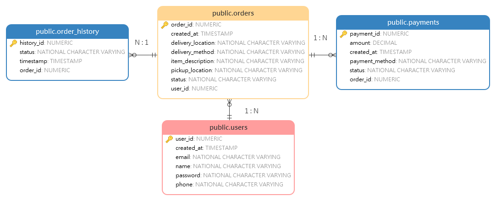

## ER diagram for the RunRun Bots Dispatch & Delivery Management System database design

1. **Entity Relationships:**

   - One USER can create many ORDERS (1:N)
   - One ORDER can have many PAYMENTS (1:N)
   - One ORDER can have many ORDER_HISTORY records (1:N)

2. **Tables Structure:**

   a. **USERS Table**

   - Primary Key: user_id
   - Contains basic user information
   - Unique constraints on email and phone
   - Timestamps for account creation

   b. **ORDERS Table**

   - Primary Key: order_id
   - Foreign Key: user_id (references USERS)
   - Contains delivery details
   - Tracks delivery method (ROBOT/DRONE)
   - Includes order status

   c. **PAYMENTS Table**

   - Primary Key: payment_id
   - Foreign Key: order_id (references ORDERS)
   - Records payment transactions
   - Tracks payment method and status

   d. **ORDER_HISTORY Table**

   - Primary Key: history_id
   - Foreign Key: order_id (references ORDERS)
   - Tracks order status changes
   - Includes timestamp for each status change

3. **Key Features:**

   - All tables include appropriate timestamps
   - Use of enumerated types for status fields
   - Proper foreign key relationships
   - Clear separation of concerns between entities

## **API Integration Requirements**

|      | **Feature**                | **API Endpoint**            | **Method**  | **Description**                      |
| ---- | -------------------------- | --------------------------- | ----------- | ------------------------------------ |
| ✅    | User Authentication        | /api/auth/login             | POST        | Authenticate user login              |
| 🟩    | User Registration          | /api/auth/signup            | POST        | Register a new user                  |
| 🟩    | Fetch User Profile         | /api/user/profile           | GET         | Retrieve user profile details        |
| 🟩    | Update User Profile        | /api/user/profile/update    | PUT         | Modify user details                  |
| 🟦    | Create Order               | /api/orders/create          | POST        | Place a new delivery order           |
| 🟦    | Get Delivery Options       | /api/orders/recommendations | GET         | Fetch optimized delivery options     |
| 🟨    | Confirm Order & Payment    | /api/orders/confirm         | POST        | Confirm order and process payment    |
| 🟧    | Order Tracking             | /api/orders/track/:id       | GET         | Get real-time tracking info          |
| 🟧    | Order History              | /api/orders/history         | GET         | Fetch past delivery orders           |
|      | Google Maps API (Frontend) | Google Maps SDK             | Client-side | Display real-time tracking interface |
|      | Google Maps API (Backend)  | Google Directions API       | Server-side | Compute optimal delivery routes      |

### ***Frontend vs Backend Google Maps API Usage**

- **Frontend:** Google Maps SDK will be used to display the **real-time tracking map** within the user interface, allowing users to visually see the robot/drone moving towards its destination. [https://developers.google.com/maps/documentation/javascript/overview](https://developers.google.com/maps/documentation/javascript/overview)

- **Backend:** Google Directions API will be utilized to **compute optimized routes**, taking into account traffic conditions, drone no-fly zones, and robot-friendly paths. The backend will then return this data to the frontend for display.